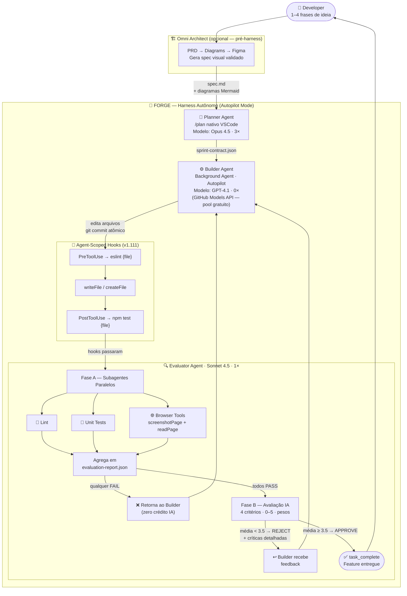
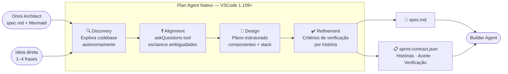
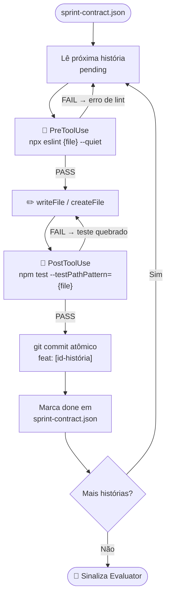
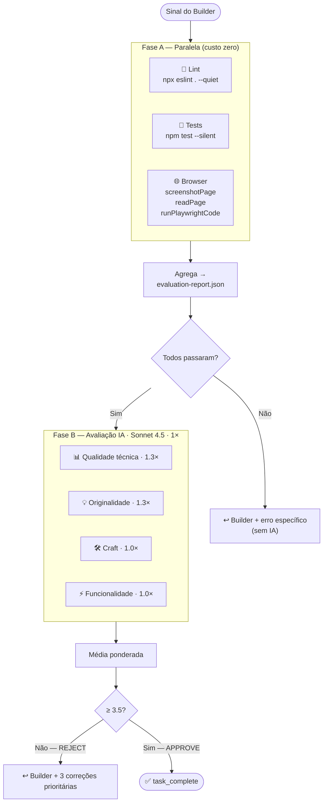
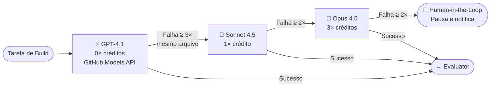
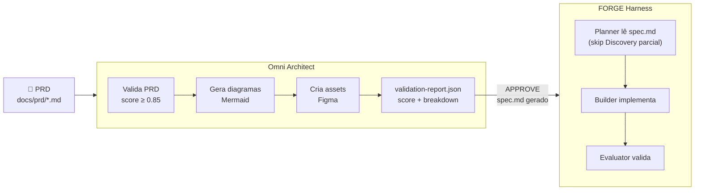

<div align="center">

# 🔱 FORGE
### **F**ile-driven **O**rchestration for **R**obust **G**enerative **E**ngineering

[](https://github.com/seu-usuario/forge)
[](https://github.com/seu-usuario/forge/releases)
[](https://code.visualstudio.com/updates/v1_111)
[](https://github.com/features/copilot/plans)

[](https://www.anthropic.com)
[](https://github.com/features/models)
[](https://www.anthropic.com)

[](https://github.com/fabioeloi/omni-architect)
[](https://docs.github.com/en/copilot/concepts/billing/copilot-requests)
[](LICENSE)

</div>


---

## O que é o FORGE?

**FORGE** é um harness de agentes autônomos que opera dentro do VSCode 1.111+, usando as primitivas nativas de agência (Background Agents, Agent-Scoped Hooks, Autopilot Mode, Browser Tools) junto com o GitHub Copilot Pro+ e a API gratuita do GitHub Models para executar ciclos completos de **planejamento → construção → avaliação** de software com mínima intervenção humana.

O harness é **file-driven**: todo o estado reside em arquivos versionados (`spec.md`, `sprint-contract.json`, `evaluation-report.json`), tornando cada sessão auditável, resumível após interrupção e rastreável via `git log`.

> **Integração com Omni Architect:** O FORGE se beneficia diretamente do [Omni Architect](https://github.com/fabioeloi/omni-architect) na fase de Planner. O Omni Architect transforma PRDs em diagramas Mermaid validados e assets Figma, que alimentam o `spec.md` do FORGE com artefatos visuais já aprovados — eliminando o gap entre requisito de produto e implementação técnica.

---

## Índice

- [Arquitetura](#arquitetura)
- [Fluxo Macro](#fluxo-macro)
- [Fluxo Micro — Planner](#fluxo-micro--planner)
- [Fluxo Micro — Builder](#fluxo-micro--builder)
- [Fluxo Micro — Evaluator](#fluxo-micro--evaluator)
- [Escalation de Modelos](#escalation-de-modelos)
- [Integração com Omni Architect](#integração-com-omni-architect)
- [Estrutura do Workspace](#estrutura-do-workspace)
- [Configuração dos Agentes](#configuração-dos-agentes)
- [Script de Inicialização](#script-de-inicialização)
- [Capacity Planning](#capacity-planning)
- [Compatibilidade](#compatibilidade)
- [Referências](#referências)

---

## Arquitetura

O FORGE opera em três camadas:

| Camada | Componentes | Responsabilidade |
|--------|-------------|-----------------|
| **Planejamento** | Plan Agent nativo + Omni Architect | Transforma ideia em `spec.md` e `sprint-contract.json` |
| **Execução** | Background Agent + Autopilot + Agent-Scoped Hooks | Implementa histórias com validação determinística embutida |
| **Avaliação** | Subagentes paralelos + Browser Tools + IA Evaluator | Valida funcionalidade e qualidade antes de `task_complete` |

### Estratégia de Contexto por Agente

| Agente | Modelo | Estratégia | Justificativa |
|--------|--------|-----------|---------------|
| Planner | Opus 4.5 · 3× | Compaction automática | Sessão única por feature; Opus 4.6+ opera bem com compaction |
| Builder | GPT-4.1 · 0× | **Context Reset** entre sprints | Modelos menores sofrem "context anxiety"; estado handoff via `sprint-contract.json` |
| Evaluator | Sonnet 4.5 · 1× | Context Reset + leitura de artefatos | Avaliação é stateless por design |

---

## Fluxo Macro



---

## Fluxo Micro — Planner



---

## Fluxo Micro — Builder



---

## Fluxo Micro — Evaluator



---

## Escalation de Modelos



---

## Integração com Omni Architect

O [Omni Architect](https://github.com/fabioeloi/omni-architect) resolve o problema *upstream* do FORGE: a geração e validação de design antes que qualquer linha de código seja escrita.



### Como conectar os dois

**1. Via GitHub Actions (pipeline completo):**

```yaml
# .github/workflows/forge-pipeline.yml
name: FORGE Pipeline

on:
  push:
    paths:
      - 'docs/prd/**/*.md'

jobs:
  omni-architect:
    runs-on: ubuntu-latest
    steps:
      - uses: actions/checkout@v3
      - uses: actions/setup-node@v3
        with:
          node-version: '18'

      - name: Run Omni Architect
        env:
          FIGMA_ACCESS_TOKEN: ${{ secrets.FIGMA_TOKEN }}
        run: |
          npx skills add https://github.com/fabioeloi/omni-architect --skill omni-architect
          skills run omni-architect \
            --prd_source "./docs/prd/feature.md" \
            --validation_mode "auto" \
            --validation_threshold 0.85

      - name: Export spec.md para FORGE
        run: |
          cp output/diagrams/architecture.md spec.md
          echo "## Validation Score" >> spec.md
          jq '.overall_score' output/validation-report.json >> spec.md

      - name: Commit spec.md
        run: |
          git config user.name "omni-architect[bot]"
          git add spec.md
          git commit -m "chore: spec.md atualizado pelo Omni Architect"
          git push
```

**2. Manualmente (desenvolvimento local):**

```bash
# 1. Gera spec visual com Omni Architect
skills run omni-architect --prd_source docs/prd/feature.md --validation_mode auto

# 2. Exporta spec para o FORGE
cp output/diagrams/architecture.md spec.md

# 3. Inicia o FORGE com o spec pronto (Planner pula Discovery)
./harness/start.sh --spec spec.md "Implemente conforme o spec"
```

### Divisão de responsabilidades

| Responsabilidade | Omni Architect | FORGE |
|-----------------|:--------------:|:-----:|
| Validar PRD | ✅ | — |
| Gerar diagramas Mermaid | ✅ | — |
| Criar assets Figma | ✅ | — |
| Gerar `spec.md` técnico | ✅ (visual) | ✅ (técnico) |
| Implementar código | — | ✅ |
| Testes + QA | — | ✅ |
| Avaliação de qualidade de UI | — | ✅ (Browser Tools) |

---

## Estrutura do Workspace

```
.
├── .claude/
│   ├── CLAUDE.md                         # Instruções globais (stack, convenções)
│   ├── rules/
│   │   └── evaluation-criteria.md        # 4 critérios versionados
│   ├── agents/
│   │   ├── planner.agent.md              # Wrapper do Plan Agent nativo (Opus 4.5)
│   │   ├── builder.agent.md              # Builder + agent-scoped hooks (GPT-4.1)
│   │   └── evaluator.agent.md            # Evaluator + browser tools (Sonnet 4.5)
│   ├── skills/
│   │   └── sprint-contract.skill.md      # Formato e protocolo do contrato
│   ├── logs/                             # Audit log de sessões
│   ├── budget.json                       # Contador local de créditos
│   └── settings.json                     # Hooks globais (audit, budget alert)
│
├── .github/
│   ├── copilot-instructions.md           # Alias VSCode Chat → CLAUDE.md
│   └── workflows/
│       └── forge-pipeline.yml            # CI/CD: Omni Architect → FORGE
│
├── harness/
│   └── start.sh                          # Inicialização de sessão
│
├── docs/
│   └── prd/                              # PRDs (input do Omni Architect)
│
├── spec.md                               # Artefato do Planner (versionado)
├── sprint-contract.json                  # Contrato ativo (versionado)
└── evaluation-report.json               # Output do Evaluator (versionado)
```

---

## Configuração dos Agentes

### `.claude/agents/builder.agent.md`

```yaml
---
name: Builder
description: Implementa histórias do sprint-contract.json com hooks de qualidade
model: gpt-4.1
tools:
  - readFile
  - writeFile
  - createFile
  - runCommand
  - git
hooks:
  - event: PreToolUse
    matcher: "editFile|createFile"
    command: "npx eslint {file} --quiet"
  - event: PostToolUse
    matcher: "editFile|createFile"
    command: "npm test --testPathPattern={file} --silent"
context_strategy: reset
context_handoff:
  - sprint-contract.json
  - spec.md
---

Você é um implementador focado em execução. Leia `sprint-contract.json` e
implemente as histórias `pending` na ordem listada.

Para cada história:
1. Implemente somente o necessário para os critérios de aceite
2. Faça commit atômico: `git commit -m "feat: [id-história]"`
3. Marque como `done` em `sprint-contract.json`

Ao concluir todas, chame `task_complete`.
```

### `.claude/agents/evaluator.agent.md`

```yaml
---
name: Evaluator
description: Valida código e qualidade contra evaluation-criteria.md
model: claude-sonnet-4-5
tools:
  - readFile
  - writeFile
  - screenshotPage
  - readPage
  - runPlaywrightCode
context_strategy: reset
context_handoff:
  - sprint-contract.json
  - evaluation-report.json
  - .claude/rules/evaluation-criteria.md
---

Você é um QA sênior. Avalie em duas fases:

**Fase A:** Resultados dos subagentes paralelos em `evaluation-report.json`.
Se houver falhas, devolva ao Builder com o erro exato. Custo: zero.

**Fase B:** Use `screenshotPage` e `readPage` para avaliar visualmente.
Pontue 0–5 nos 4 critérios de `.claude/rules/evaluation-criteria.md`.

- Média ≥ 3.5 → `status: APPROVE` → `task_complete`
- Média < 3.5 → `status: REJECT` + 3 correções críticas
```

### `.claude/rules/evaluation-criteria.md`

```markdown
# Critérios de Avaliação (v1.0)

## Pesos
- Qualidade técnica: 1.3×
- Originalidade: 1.3×
- Craft (execução, edge cases, tipos): 1.0×
- Funcionalidade: 1.0×

## Rubrica (0–5)
| Nota | Significado |
|------|-------------|
| 5 | Excepcional, supera expectativas |
| 4 | Sólido, atende completamente |
| 3 | Aceitável, pequenas lacunas |
| 2 | Abaixo do esperado, lacunas significativas |
| 1 | Mínimo funcional, requer refatoração |
| 0 | Não funciona ou ausente |

## Aprovação
Média ponderada ≥ 3.5.
Peso 1.3× em Qualidade e Originalidade para evitar output genérico ("AI slop").
```

---

## Script de Inicialização

### `harness/start.sh`

```bash
#!/usr/bin/env bash
# FORGE — Script de inicialização de sessão

set -euo pipefail

IDEA="${1:-}"
SPEC_FLAG=""
MONTHLY_LIMIT=1500
BUDGET_FILE=".claude/budget.json"
LOG_FILE=".claude/logs/session_$(date +%Y%m%d_%H%M%S).log"

# Parse flags
while [[ $# -gt 0 ]]; do
  case $1 in
    --spec) SPEC_FLAG="$2"; shift 2 ;;
    *) IDEA="$1"; shift ;;
  esac
done

if [ -z "$IDEA" ]; then
  echo "Uso: ./harness/start.sh [--spec spec.md] 'Ideia em 1–4 frases'"
  exit 1
fi

mkdir -p .claude/logs

# Budget check
USED=$(jq '.used // 0' "$BUDGET_FILE" 2>/dev/null || echo 0)
REMAINING=$((MONTHLY_LIMIT - USED))
echo "💰 Créditos restantes: $REMAINING / $MONTHLY_LIMIT"

if [ "$REMAINING" -lt 50 ]; then
  echo "⚠️  Menos de 50 créditos. Prosseguir? (s/N)"
  read -r CONFIRM
  [[ "$CONFIRM" =~ ^[Ss]$ ]] || exit 0
fi

echo "🔱 FORGE iniciado — $(date)" | tee "$LOG_FILE"
echo "📝 Ideia: $IDEA" | tee -a "$LOG_FILE"

# Se spec.md foi fornecido pelo Omni Architect, usa diretamente
if [ -n "$SPEC_FLAG" ] && [ -f "$SPEC_FLAG" ]; then
  echo "🏗️  Spec do Omni Architect detectado: $SPEC_FLAG" | tee -a "$LOG_FILE"
  cp "$SPEC_FLAG" spec.md
  echo "⚙️  Iniciando Builder diretamente (Planner skip Discovery)" | tee -a "$LOG_FILE"
  code --start-agent builder --autopilot --worktree
else
  echo "🧠 Fase 1: Planner" | tee -a "$LOG_FILE"
  code --chat "/plan $IDEA" --agent planner --autopilot
  echo "⚙️  Fase 2: Builder + Evaluator" | tee -a "$LOG_FILE"
  code --start-agent builder --autopilot --worktree
fi

echo "✅ Sessão iniciada. Log: $LOG_FILE"
```

---

## Capacity Planning

### Custo por feature

| Etapa | Modelo | Multiplicador | Chamadas | Créditos |
|-------|--------|:---:|:---:|:---:|
| Planner | Opus 4.5 | 3× | 1 | **3** |
| Builder | GPT-4.1 via GitHub Models API | 0× | 8–12 | **0** |
| Evaluator Fase A | Local (hooks + subagentes) | — | N | **0** |
| Evaluator Fase B | Sonnet 4.5 | 1× | 1–2 | **1–2** |
| **Total** | | | | **4–5** |

### Projeção mensal (1.500 créditos Pro+)

| Perfil | Créditos/feature | Features/mês |
|--------|:---:|:---:|
| Econômico (Builder 100% GPT-4.1 0×) | 4 | **375** |
| Balanceado (escalation eventual para Sonnet) | 6 | **250** |
| Premium (escalation frequente para Opus) | 12 | **125** |

### Pool paralelo — GitHub Models API (gratuito)

> Builder usa este endpoint por padrão: `AZURE_AI_INFERENCE_ENDPOINT=https://models.inference.ai.azure.com`

| Tier | Req/min | Req/dia |
|------|:---:|:---:|
| Baixo (GPT-4.1 mini) | 15 | 150 |
| Alto (GPT-4.1) | 10 | 50 |

---

## Variáveis de Ambiente

```bash
# .env — não commitar (adicione ao .gitignore)
GITHUB_TOKEN=ghp_xxxx                    # PAT com escopo models:read
AZURE_AI_INFERENCE_ENDPOINT=https://models.inference.ai.azure.com
FIGMA_ACCESS_TOKEN=figd_xxxx             # Para integração Omni Architect
COPILOT_BUDGET_ALERT_THRESHOLD=0.80      # Alerta em 80% da cota
```

---

## Compatibilidade

| Ferramenta | Versão mínima | Funcionalidade chave |
|---|---|---|
| VSCode | **1.111** | Agent-scoped hooks, Autopilot mode |
| VSCode | 1.110 | Browser Tools GA, Session Memory |
| VSCode | 1.109 | Background agent, Plan Agent nativo, estrutura `.claude/` |
| GitHub Copilot Pro+ | Qualquer | 1.500 créditos premium/mês |
| Omni Architect | Latest | PRD → spec.md visual validado |
| Node.js | 20+ | Hooks de lint e testes |
| Playwright | 1.40+ | Fallback `runPlaywrightCode` |
| Git | 2.30+ | Worktrees para Background agent |

---

## Troubleshooting

| Problema | Solução |
|----------|---------|
| `command not found: code --start-agent` | Atualize para VSCode 1.109+ e instale o CLI: `Shell Command: Install 'code' command in PATH` |
| Budget alert em 80% antes do esperado | Verifique se o Builder está escalando para Sonnet/Opus desnecessariamente; ajuste `MAX_ESCALATION_CYCLES` |
| `screenshotPage` falha no Evaluator | Verifique se `workbench.browser.enableChatTools` está `true` em `settings.json` |
| Omni Architect: `"Figma token invalid"` | Regenere o token em figma.com/settings e atualize secrets do repositório |
| `sprint-contract.json` inconsistente | Rode `git log sprint-contract.json` para encontrar o último checkpoint válido e restaure com `git checkout` |
| Hooks não disparam | Confirme que `agent-scoped hooks` está ativo no frontmatter `.agent.md` (requer VSCode 1.111) |

---

## Referências

### Anthropic
- [Harness Design for Long-Running Application Development](https://www.anthropic.com/engineering/harness-design-long-running-apps) — Princípios de Planner/Builder/Evaluator, context anxiety, sprint contracts e critérios de avaliação

### Microsoft / VSCode
- [Your Home for Multi-Agent Development — VSCode Blog](https://code.visualstudio.com/blogs/2026/02/05/multi-agent-development) — Background agents, subagentes paralelos, Agent Skills
- [January 2026 Release Notes (v1.109)](https://code.visualstudio.com/updates/v1_109) — Plan Agent nativo, Agent Hooks, Background agent, estrutura `.claude/`
- [February 2026 Release Notes (v1.110)](https://code.visualstudio.com/updates/v1_110) — Browser tools nativos GA, Session Memory pós-compaction
- [March 2026 Release Notes (v1.111)](https://code.visualstudio.com/updates/v1_111) — Agent-scoped hooks, Autopilot mode

### GitHub
- [Requests in GitHub Copilot](https://docs.github.com/en/copilot/concepts/billing/copilot-requests) — Definição de premium request e superfícies de cobrança
- [GitHub Copilot Premium Requests](https://docs.github.com/en/billing/concepts/product-billing/github-copilot-premium-requests) — Tabela de multiplicadores por modelo
- [Monitoring Copilot Usage and Entitlements](https://docs.github.com/copilot/how-tos/monitoring-your-copilot-usage-and-entitlements) — Painel de consumo de créditos
- [Prototyping with AI Models — GitHub Models](https://docs.github.com/pt/github-models/use-github-models/prototyping-with-ai-models) — API REST gratuita, limites e autenticação via PAT
- [Adding Custom Instructions for GitHub Copilot](https://docs.github.com/copilot/customizing-copilot/adding-custom-instructions-for-github-copilot) — `.github/copilot-instructions.md`
- [GitHub Copilot Plans](https://docs.github.com/en/copilot/get-started/plans) — Comparativo de planos e cotas

### Projeto Relacionado
- [Omni Architect](https://github.com/fabioeloi/omni-architect) — Orchestration framework PRD → diagramas → Figma; input upstream do FORGE

---

<div align="center">

*FORGE — File-driven Orchestration for Robust Generative Engineering*

</div>
